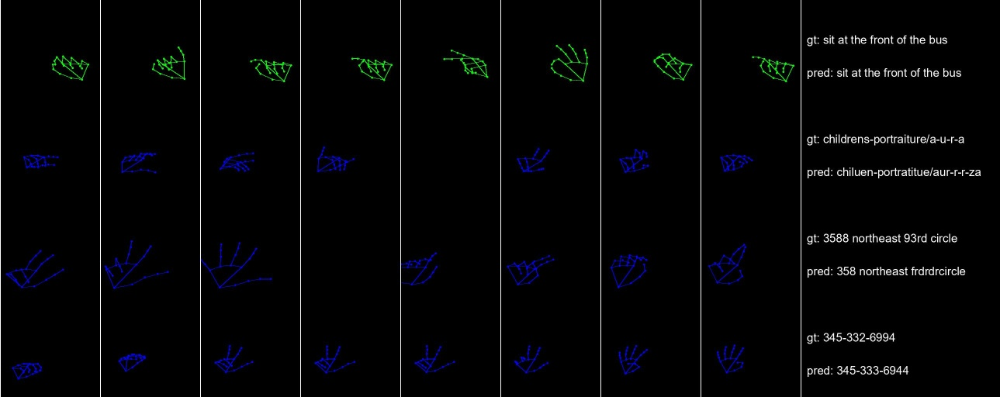

# Kaggle ASL Competition

- Preparing Data
  
  .parquet file -> Each keypoint .pt file

  Using right, left hand x, y keypoints (and pose(choice))

- Model

  Transformer with PyTorch, wandb

  And Data Augmentataion to preventing overfitting (too small data!!)

- Latest Result (7/27)

  Levenshtein Distance : 0.58

  